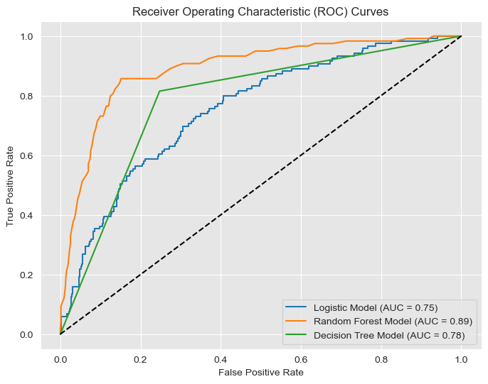
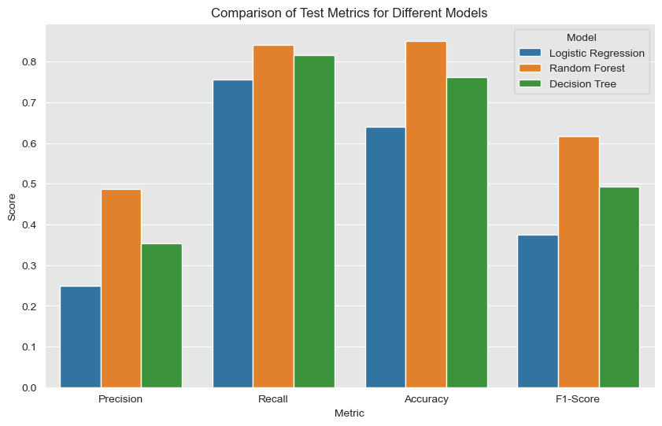
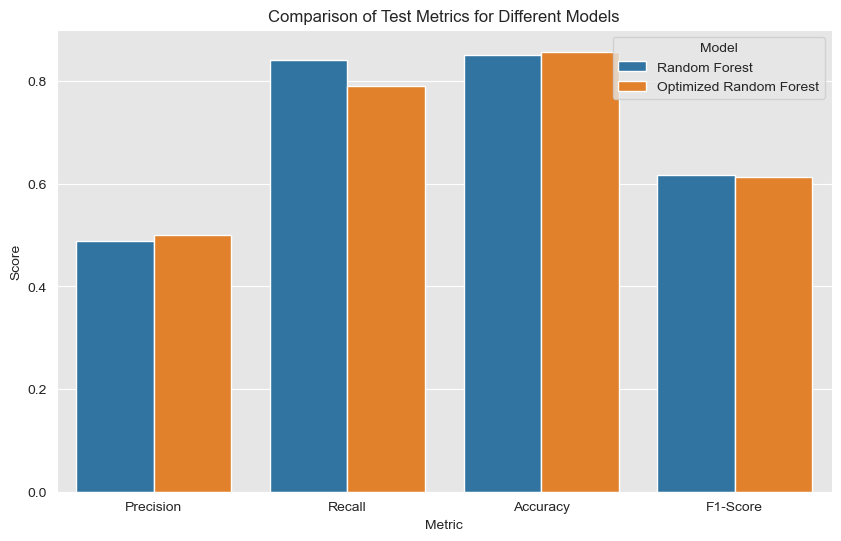
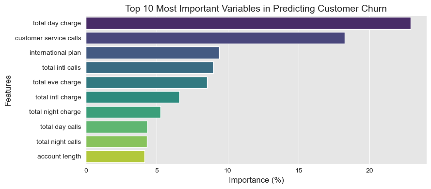

# SyriaTel Customer Churn Prediction Model

## Overview
Build a classifier to predict whether a customer will ("soon") stop doing business with SyriaTel, a telecommunications company. They are interested in reducing how much money is lost because of customers who don't stick around very long. The question you can ask is: are there any predictable patterns here?

## Business Understanding
**Objective**: Predict customer churn for SyriaTel and reduce the loss of revenue from customers leaving. We aim to create a model for churn prediction that helps the telecom company design targeted retention strategies.

**Stakeholder**: SyriaTel telecommunications company.

**Problem**: Customers leave which causes Syriatel to lose money.

**Key Questions**:
* What are the main factors driving churn?
* Can we identify churn-prone customers in advance?

**Success Metrics**:
1. Primary Metric: Recall - to identify potential churners and use strategies to prevent them from churning
2. Secondary Metric: Precision - to avoid overspending on non-churners
3. To evaluate and compare overall performance of our models, we will use AUC-ROC in addition to recall and precision.

## Data Understanding
The SyriaTel data set includes 21 features and 3333 customer entries. Since our goal is to predict customer churn, the target variable is churn. We will focus on account activity rather than the customer profile, so we will drop state, area code, and phone number.

Target variable:
Churn

Fields to include:
* account length
* number vmail messages
* total day minutes
* total day calls
* total day charge
* total eve minutes
* total eve calls total eve charge
* total night minutes
* total night calls
* total night charge
* total intl minutes
* total intl calls
* total intl charge
* cusomter service calls

Fields to drop
* state
* area code
* phone number

## Data Preparation
There are many highly correlated fields in the dataset which makes sense because the more minutes you have, the higher your bill will be. Therefore, we will only use 1 of each of the correlated fields. We will keep:
* voicemail plan
* total intl charge
* total night charge
* total eve charge
* total day charge

## Analysis and Results/Recommendations

**Comparison of 3 Models: Logistic Regression, Random Forest, and Decision Tree**



**Comparison of Baseline Random Forest and New Random Forest after Hyperparameter Tuninge**


**Feature Importance**


The baseline and optimized model perform similarly so we have to revert to the business question to choose our final model. Because the highest priority is to identify at-risk customers, we will choose the baseline Random Forest model as it has the highest Recall on the testing data (84%). While the optimized version improved slightly in Accuracy, its lower Recall means it could miss more at-risk customers, making the baseline Random Forest the better choice for this goal.

**Business Recommendation 1** - Address Concerns Related to Customer Service Calls
High customer service calls may indicate unresolved issues or dissatisfaction. Introduce proactive support measures, such as training representatives to resolve issues on the first call or implementing a follow-up system to ensure customer concerns are addressed promptly. This can help reduce frustration and improve retention.

**Business Recommendation 2** - Tailor Offers for High Spending Customers
Customers with higher day charges may feel the service is too expensive or lack perceived value. Create personalized retention strategies for these customers, such as offering loyalty discounts, bundled plans, or value-added services that enhance their experience and justify the cost.

**Business Recommendation 3** - Incentivize and Simplify International Plans
Customers using international plans or making frequent international calls may value affordability and reliability. Offer competitive pricing for international plans, promotional discounts for frequent international callers, or free trials for new plans to encourage continued usage and build loyalty.

## Conclusion and Next Steps
In this project, we successfully built a churn prediction model using Random Forest, which demonstrated strong performance with an 84% Recall, ensuring we effectively identify customers at risk of churning. Key drivers of churn, including total day charge, customer service calls, and international plan usage, informed targeted business recommendations such as enhancing customer service, offering tailored loyalty incentives for high spenders, and optimizing international plans to retain valuable customers. These insights empower SyriaTel to take proactive, data-driven actions to reduce customer churn, minimize revenue loss, and foster stronger customer relationships.

Next Steps:
1. Evaluate Alternative Models for Enhanced Performance:
Test other advanced models like Gradient Boosting or ensemble approaches to identify opportunities for better churn prediction accuracy and Recall.
2. Optimize Hyperparameter Tuning for Improved Results:
Refine the hyperparameter search strategy using more granular or advanced optimization methods to further improve model performance.
3. Incorporate Customer Demographics into Analysis:
Include features like area code and state to explore how customer profiles influence churn, enabling more tailored retention strategies.

## For More Information

See the full analysis in the [Jupyter Notebook](./Final.ipynb) or review this [presentation](./Presentation.pdf).

For additional info, contact Hannah Dallas at [hrdallas1@gmail.com](mailto:hrdallas1@gmail.com.com)

## Repository Structure

```
├── Images
├── Final.ipynb
├── Data
├── README.md
├──Presentation.pdf
